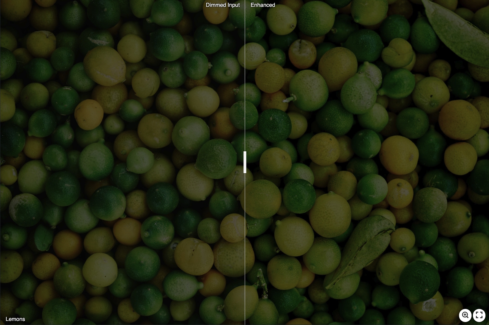

# PerceptDimmed
A Perceptually-Based Deep Learning Approach for Energy-Preserving Image Enhancement

# Output results
Please click on the image to see the image clearly.
## Lemons
### The dimmed input |||  The DCT-based output | The gradient-based output
 
